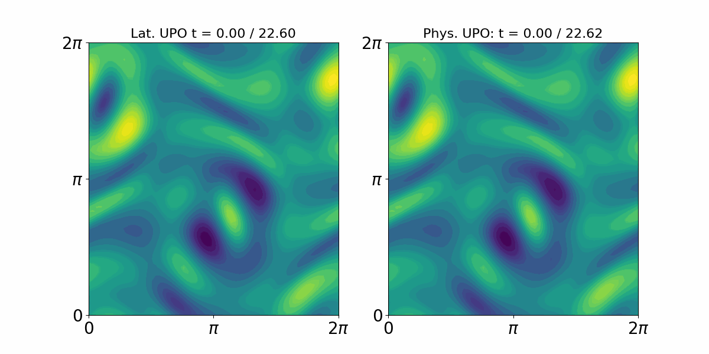

# Identifying recurrent flows from low-dimensional embeddings

This repository accompanies the preprint
[**Identifying recurrent flows in high-dimensional dissipative chaos from low-dimensional embeddings**](https://arxiv.org/abs/2601.01590)
by Pierre Beck and Tobias M. Schneider.

The code implements the paper's automatic-differentiation-based loop-convergence
method for identifying unstable periodic orbits (UPOs) in learned,
low-dimensional representations of high-dimensional chaotic systems. Two
examples are included:

- the one-dimensional Kuramoto-Sivashinsky equation; and
- Kolmogorov flow governed by the two-dimensional Navier-Stokes equations.

Each example is organized as a sequence of numbered Python scripts covering
POD preprocessing, autoencoder training and evaluation, recurrent flow analysis,
latent loop convergence, and final convergence in the physical state space.



*Comparison of a UPO converged in the learned latent space (left) with its (sliced)
physical-space counterpart (right) for Kolmogorov flow.*

## Repository structure

```text
.
├── requirements.txt
├── Kuramoto_Sivashinsky/
│   ├── 1_POD_modes.py
│   ├── 2_train.py
│   ├── 3_load_net_and_evaluate.py
│   ├── 4_latent_recurrent_flow.py
│   ├── 5_autodiff_latent_looping.py
│   ├── 6_autodiff_physical_looping.py
│   ├── jax_helper_fns.py
│   └── kse_fns.py
└── 2D_Navier_Stokes/
    ├── 1_POD_modes.py
    ├── 2_train.py
    ├── 3_load_net_and_evaluate.py
    ├── 4_latent_recurrent_flow.py
    ├── 5_autodiff_latent_looping.py
    ├── 6_autodiff_physical_looping.py
    ├── jax_helper_fns.py
    └── kol_fns.py
```

## Installation

The supplied [`requirements.txt`](requirements.txt) is a reduced version of the
environment used for the calculations. It contains only the direct runtime
dependencies and pins the tested JAX 0.4.30/CUDA 12 stack. For example, create
a Conda environment and install it with:

```bash
conda create -n autodiff-loops python=3.10 pip
conda activate autodiff-loops
python -m pip install --upgrade pip
python -m pip install -r requirements.txt
```

All calculations in the paper were run on NVIDIA GPUs. The pinned environment
uses CUDA 12; users with a different CUDA setup should install the corresponding
JAX build by following the
[JAX installation guide](https://docs.jax.dev/en/latest/installation.html), then
install the remaining dependencies. Confirm that JAX sees the accelerator with:

```bash
python -c "import jax; print(jax.devices())"
```

JAX performs the accelerator computations. PyTorch is used only for CPU-side
data loading, so the requirements deliberately select its smaller CPU wheel.

The Kolmogorov-flow calculations were run on an NVIDIA H100 GPU and can be memory 
intensive. An H100 is not a strict requirement, for example the training was also run on
an RTX A4000. Smaller devices may require reduced batch sizes, fewer loaded snapshots, 
or other changes to the parameters near the top of the scripts. CPU execution has not
been used for the reported calculations and is likely to be substantially slower.

### JAX-CFD

The requirements install [our JAX-CFD fork](https://github.com/Pibe97/jax-cfd),
which corrects a dealiasing filter used in this work. The
[official Google JAX-CFD repository](https://github.com/google/jax-cfd) should
also work completely fine; to use it, replace the final line of
`requirements.txt` with `jax-cfd==0.2.1`.

## Paper data

The simulation data, precomputed POD representations, trained networks, and
example recurrent solutions used in the paper are available in the
[Zenodo data record](https://zenodo.org/records/22031661).

Download and extract the data so that the main inputs have the following
layout:

```text
Kuramoto_Sivashinsky/data/paper_data/
├── DNS.mat
├── POD_modes.mat
└── net/

2D_Navier_Stokes/data/paper_data/
├── POD_modes.h5
└── net/
```

For the Kuramoto--Sivashinsky example, the flow snapshots are stored in
`DNS.mat`. For the Kolmogorov-flow example, the processed flow snapshots are
the `fluctuations` dataset in `POD_modes.h5`; this file also contains the POD
modes used by the scripts. If the archive's precomputed POD data and trained
network are used, scripts `1` and `2` can be skipped.

The raw Kolmogorov-flow snapshots consumed by `1_POD_modes.py` are not required
when using the provided `POD_modes.h5`. To regenerate them, adapt the
[JAX-CFD spectral forced-turbulence notebook](https://github.com/google/jax-cfd/blob/main/notebooks/spectral_forced_turbulence.ipynb),
save the snapshots as `data/paper_data/flow_data/dataset_*.mat`, and then run
script `1`.

## Running the examples

Run every script from inside the directory in which it is located. The code
uses local imports and paths relative to the current working directory, so, for
example, run:

```bash
cd Kuramoto_Sivashinsky
python 1_POD_modes.py
```

and not `python Kuramoto_Sivashinsky/1_POD_modes.py` from the repository root.

Before running a script, inspect the parameter and path definitions near its
top. These expose the main quantities a user may want to change, including the
latent dimension, training parameters, integration time, recurrence threshold,
period range, network directory, input guess, and output directory.

There are two supported ways to use the workflows:

1. **Use the paper artifacts.** Keep the data and checkpoint paths pointed at
   `data/paper_data` and start at script `3` or `4`.
2. **Recompute from scratch.** Run scripts `1` and `2`, then point subsequent
   `data_dir`, `data_folder`, or `net_dir` variables at the corresponding files
   under `data/outputs`.

### Kuramoto--Sivashinsky

```bash
cd Kuramoto_Sivashinsky
```

1. **Compute POD modes**

   ```bash
   python 1_POD_modes.py
   ```

   Loads `data/paper_data/DNS.mat`, computes the POD representation, and writes
   `data/outputs/POD_modes.mat`.

2. **Train the hybrid autoencoder**

   ```bash
   python 2_train.py
   ```

   Trains the hybrid autoencoder and saves its checkpoint and losses to
   `data/outputs/networks/net`. To train on the POD file produced by step 1,
   change `data_folder` at the top of the script to `data/outputs`; its default
   value uses the precomputed POD file in `data/paper_data`.

3. **Load and evaluate the network**

   ```bash
   python 3_load_net_and_evaluate.py
   ```

   Restores the network and visualizes the latent attractor, reconstructed
   states, and reconstructed time derivatives. Set `net_dir` to either the
   newly trained network in `data/outputs/networks/net` or the downloaded
   network in `data/paper_data/net`.

4. **Find recurrent-flow guesses in latent space**

   ```bash
   python 4_latent_recurrent_flow.py
   ```

   Integrates the learned latent dynamics, performs a recurrence search, and
   writes `trajectory.mat`, `params.mat`, and candidate `guess_*.mat` files to
   `data/outputs/recurrent_flow`. Configure `dt`, `t_max`, `r`, `T_min`,
   `T_max`, `nloop`, `Nt_desired`, and `net_dir` near the top of the script.

5. **Converge a loop in latent space**

   ```bash
   python 5_autodiff_latent_looping.py
   ```

   Set `guess_name` to one of the candidates from step 4. The script first uses
   L-BFGS and then Gauss--Newton optimization. A successfully converged decoded
   loop is saved under `data/outputs/recurrent_flow/converged`.

6. **Refine the loop in physical state space**

   ```bash
   python 6_autodiff_physical_looping.py
   ```

   Set `file_name` to a converged result from step 5. The final physical-space
   refinement is saved alongside it with a `phys_` filename prefix.

### Kolmogorov flow / two-dimensional Navier--Stokes

```bash
cd 2D_Navier_Stokes
```

1. **Compute POD modes**

   ```bash
   python 1_POD_modes.py
   ```

   Loads locally generated `dataset_*.mat` snapshots from
   `data/paper_data/flow_data`, constructs the spectral state representation,
   and writes `data/outputs/POD_modes.h5`. This step is unnecessary when using
   the precomputed Zenodo file. See the data section above for the simulation
   notebook used to generate equivalent Kolmogorov-flow data.

2. **Train the hybrid autoencoder**

   ```bash
   python 2_train.py
   ```

   Trains the Navier--Stokes autoencoder and writes the checkpoint and losses to
   `data/outputs/networks/net`. The amount of POD data loaded for training is
   controlled by the slice near the top of the main block and should be increased 
   for ideal performance. To use the POD file from step 1, update `data_dir` in 
   `jax_helper_fns.py` or place the file at the path configured there.

3. **Load and evaluate the network**

   ```bash
   python 3_load_net_and_evaluate.py
   ```

   Restores the selected network and compares original and reconstructed
   vorticity fields and their time derivatives. Set `net_dir` to the downloaded
   checkpoint or to the output from step 2.

4. **Find recurrent-flow guesses in latent space**

   ```bash
   python 4_latent_recurrent_flow.py
   ```

   Integrates the learned latent dynamics and saves the trajectory, search
   parameters, and `guess_*.mat` candidates under
   `data/outputs/recurrent_flow`. The integration and recurrence-search
   parameters are defined at the top of the script.

5. **Converge a loop in latent space**

   ```bash
   python 5_autodiff_latent_looping.py
   ```

   Set `guess_name` to a candidate from step 4. The decoded result is written to
   `data/outputs/recurrent_flow/converged` when convergence succeeds.

6. **Refine the loop in physical state space**

   ```bash
   python 6_autodiff_physical_looping.py
   ```

   Set `file_name` to the converged latent solution from step 5. The script uses
   the decoded loop as its initial condition for physical-space convergence.

## Outputs and reproducibility

Generated files are written below each example's `data/outputs` directory and
are ignored by Git. Several steps use random shuffling or a randomly selected
initial condition, so repeated runs need not produce identical candidates or
training histories unless random seeds are fixed explicitly.

Training and loop convergence can be computationally and memory intensive,
especially for the two-dimensional Navier--Stokes example. Adjust the batch
size and amount of loaded data if the default calculation exceeds the available
device memory.

## Citation

If you use this code or the accompanying data, please cite:

```bibtex
@misc{beck2026identifying,
  title         = {Identifying recurrent flows in high-dimensional dissipative
                   chaos from low-dimensional embeddings},
  author        = {Beck, Pierre and Schneider, Tobias M.},
  year          = {2026},
  eprint        = {2601.01590},
  archivePrefix = {arXiv},
  primaryClass  = {nlin.CD},
  url           = {https://arxiv.org/abs/2601.01590}
}
```

The implementation uses [JAX](https://github.com/jax-ml/jax) and the spectral
solver in [JAX-CFD](https://github.com/google/jax-cfd). Please also cite these
projects when using this code:

```bibtex
@software{jax2018github,
  author  = {James Bradbury and Roy Frostig and Peter Hawkins and
             Matthew James Johnson and Yash Katariya and Chris Leary and
             Dougal Maclaurin and George Necula and Adam Paszke and
             Jake Vander{P}las and Skye Wanderman-{M}ilne and Qiao Zhang},
  title   = {{JAX}: composable transformations of {P}ython+{N}um{P}y programs},
  url     = {http://github.com/jax-ml/jax},
  version = {0.3.13},
  year    = {2018},
}

@article{Dresdner2022-Spectral-ML,
  doi       = {10.48550/ARXIV.2207.00556},
  url       = {https://arxiv.org/abs/2207.00556},
  author    = {Dresdner, Gideon and Kochkov, Dmitrii and Norgaard, Peter and
               Zepeda-Núñez, Leonardo and Smith, Jamie A. and
               Brenner, Michael P. and Hoyer, Stephan},
  title     = {Learning to correct spectral methods for simulating turbulent
               flows},
  publisher = {arXiv},
  year      = {2022},
  copyright = {arXiv.org perpetual, non-exclusive license}
}
```

## Acknowledgements

This work was supported by the European Research Council (ERC) under the
European Union’s Horizon 2020 research and innovation programme (Grant No.
865677).
